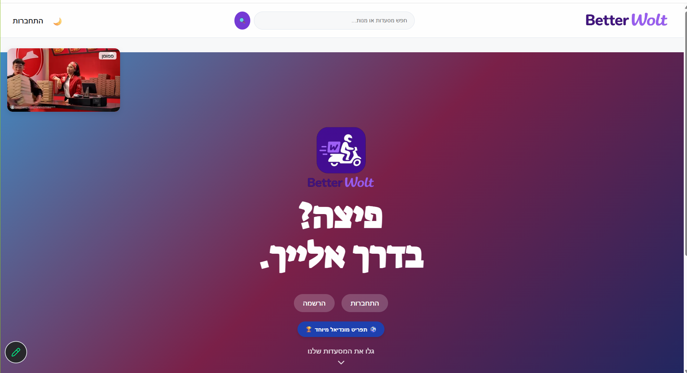
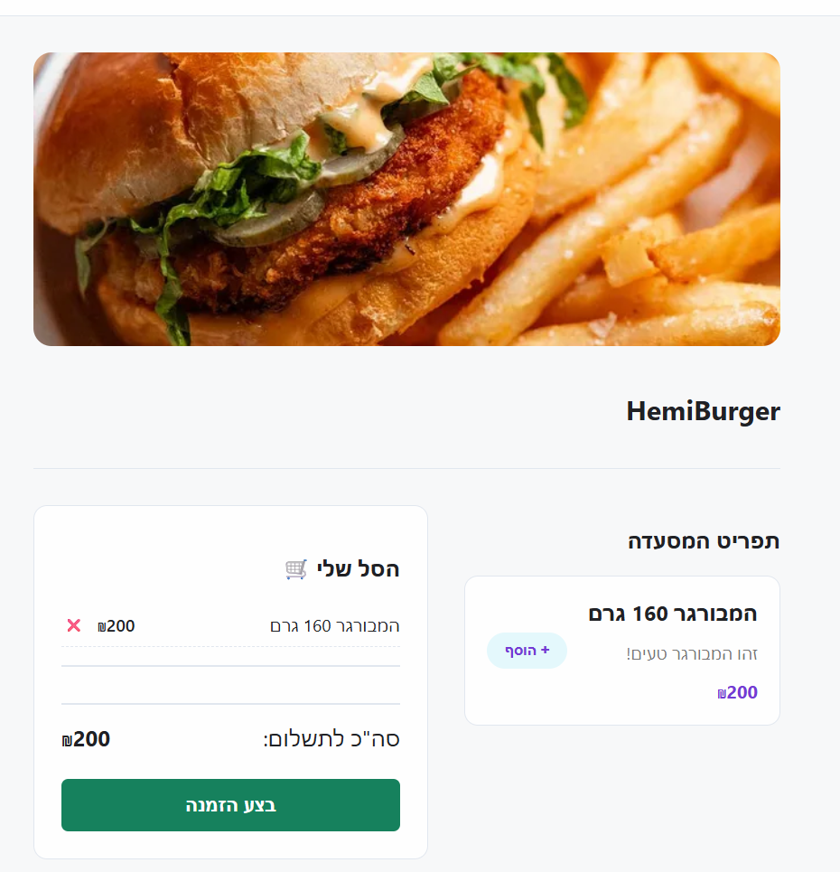
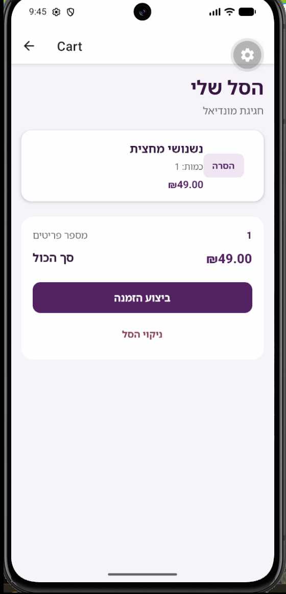
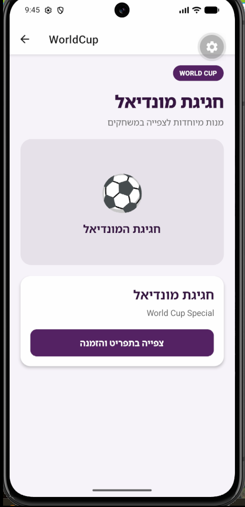

# Better Wolt

Better Wolt is an educational, Wolt-inspired full-stack food-delivery platform with a React web client, a React Native/Expo mobile client, and a shared Node.js/Express REST API backed by MongoDB.

This project is not affiliated with or endorsed by Wolt.

**Course project final grade: 97/100**

## Key Features

- Customer and restaurant-owner account registration and sign-in
- JWT-based authentication for protected API operations
- Restaurant and menu creation, editing, and deletion for restaurant owners
- Server-side authorization and ownership checks for restaurant and menu changes
- Restaurant search by name, address, menu item, or menu description
- Cart management and authenticated order placement
- User-specific order history and a web order-tracking experience
- React web application served by the backend in production
- React Native mobile application developed with Expo
- World Cup-themed ordering experiences on web and mobile
- Custom web media features, including rotating promotional videos and event audio
- Dockerized backend and MongoDB services with persistent database storage

## Screenshots

### Web

<p align="center">
  
</p>

<p align="center">
  
</p>

### Mobile

<p align="center">
  
  &nbsp;&nbsp;&nbsp;
  
</p>

## Architecture

```text
React Web -----------\
                      -> Node.js / Express REST API -> MongoDB
React Native / Expo -/
```

The web and mobile applications consume the same REST API. The production backend image builds the React client and serves its static output alongside the API, while the Expo application connects to the API over HTTP.

The backend is organized by feature (`web-server/src/features/<name>/` with `routes → controller → service → model`), with shared HTTP plumbing in `src/http/`. See the documentation below for the structure, the API contract, and how to add a feature.

## Documentation

- [docs/ARCHITECTURE.md](docs/ARCHITECTURE.md) — structure, conventions and the full API contract
- [docs/EXTENDING.md](docs/EXTENDING.md) — how to add a backend feature, with a worked example
- [docs/V2_SPEC.md](docs/V2_SPEC.md) — scope, invariants and the deliberate behavior changes
- [docs/V2_IMPLEMENTATION_PLAN.md](docs/V2_IMPLEMENTATION_PLAN.md) — the phased plan and what was verified
- [AGENTS.md](AGENTS.md) — branch policy, commands and conventions for contributors

## Tech Stack

### Backend

- Node.js
- Express
- Mongoose
- JSON Web Tokens (`jsonwebtoken`)
- `bcryptjs`
- Zod for request validation
- `express-rate-limit`
- CORS and environment-based configuration
- `node:test` and `supertest` for integration tests against MongoDB 7

### Web

- React
- React Router
- Create React App / `react-scripts`
- HTML and CSS

### Mobile

- React Native
- Expo
- React Navigation
- AsyncStorage
- Expo Image Picker

### Database

- MongoDB
- Mongoose schemas for users, restaurants, embedded menu products, and orders

### Infrastructure

- Docker and Docker Compose
- Multi-stage backend image that builds and embeds the React production bundle, runs as a non-root user and exposes a health check
- MongoDB health check and named volume for persistence
- GitHub Actions CI

## Security / Backend Design

- Passwords are hashed with bcrypt before storage.
- Protected endpoints authenticate bearer tokens using JWTs.
- Restaurant and menu mutations are authorized against the authenticated restaurant owner.
- Order creation is server-authoritative: the API resolves products from the selected restaurant, snapshots item names and prices, calculates item counts and totals, and sets the initial status and timestamps.
- Clients submit product identifiers and quantities; they cannot choose authoritative order prices, totals, or status values.
- Request bodies are validated with Zod at the route boundary; errors are returned as `{ "error": "..." }` without driver or stack text.
- Login and registration are rate limited per IP, unknown usernames still run a bcrypt comparison (so timing does not reveal which accounts exist), and only HS256 tokens are accepted.
- JSON bodies are limited to 100 KB, except registration (5 MB) which may carry an avatar.
- Search queries are matched literally, not as regular expressions.
- The API container runs as a non-root user, and MongoDB is published on `127.0.0.1` only.
- Sensitive payment-card data is not collected or stored. The project does not implement payment processing.

## Project Structure

```text
web-server/             Node.js/Express API (src/features/...) and the React web client
web-server/test/        API integration tests (node:test + supertest)
mobile/                 React Native/Expo mobile client
docs/                   Architecture, API contract, extension guide and the V2 plan
docker-compose.yml      Backend, MongoDB and the optional Expo dev server
docker-compose.test.yml Throwaway MongoDB for the test suite
.github/workflows/      CI: API tests, web tests and build, image build, mobile bundle
.env.example            Required environment-variable template
```

## Running the Web Application

Docker and Docker Compose are required.

1. Copy `.env.example` to `.env`.
2. Replace the example value in `.env` with a long, random `JWT_SECRET`.
3. Build and start MongoDB and the backend:

   ```bash
   docker compose up --build mongo backend
   ```

4. Open [http://localhost:8080](http://localhost:8080).

The backend container waits for MongoDB to become healthy, builds the React production client, and serves both the web application and the API on port `8080`.

## Running the Mobile Application

Start the backend before launching the mobile client. With an Android emulator available, run:

```bash
cd mobile
npm ci
npx expo start --android
```

The existing mobile API configuration reads `EXPO_PUBLIC_API_URL` when supplied and otherwise falls back to `http://10.0.2.2:8080/api`, which maps the Android emulator to the backend running on the host machine.

## Development

For a fast edit-reload loop, run MongoDB in Docker and the API and web client on the host:

1. Start MongoDB only: `docker compose up -d mongo` (published on `127.0.0.1:27017`).
2. Create `web-server/.env` with at least `JWT_SECRET=<a long random value>`. See `.env.example` for the optional variables.
3. Start the API with reload on change:

   ```bash
   cd web-server
   npm ci
   npm run dev          # http://localhost:8080
   ```

4. In a second terminal, start the web client:

   ```bash
   cd web-server/client
   npm ci
   npm start            # http://localhost:3000, /api is proxied to :8080
   ```

`GET /api/health` returns `{"status":"ok"}` when the API has a live database connection, and `503` otherwise.

## Testing

The API integration tests run against a real MongoDB 7 (Docker required for the local database):

```bash
cd web-server
npm ci
npm run test:db:up     # throwaway MongoDB on 127.0.0.1:27018 (in memory)
npm test
npm run test:db:down
```

To use another MongoDB 7 instance instead, set `TEST_MONGODB_URI` (each test file creates and drops its own `bw_test_*` database).

Web client tests: `cd web-server/client && npm test -- --watchAll=false`.

## Special World Cup Feature

The World Cup experience is an intentional product and UI feature beyond the core restaurant-browsing and ordering flow. It presents country-themed dishes through dedicated web and mobile interfaces, with supporting media in the web experience.

These dishes are not client-only mock data: the backend seeds a dedicated restaurant and menu as real MongoDB records. Orders placed through the feature use those persisted product identifiers and pass through the same authenticated, server-authoritative order flow as standard restaurant orders.

## Team Project

Better Wolt was jointly developed as a collaborative team project. Its web, mobile, backend, database, and infrastructure elements are presented as the result of the team's shared work rather than as individually owned subsystems.

## Disclaimer

Better Wolt is an educational project inspired by Wolt. It is not affiliated with, sponsored by, or endorsed by Wolt. Wolt and all other third-party trademarks and assets remain the property of their respective owners.
