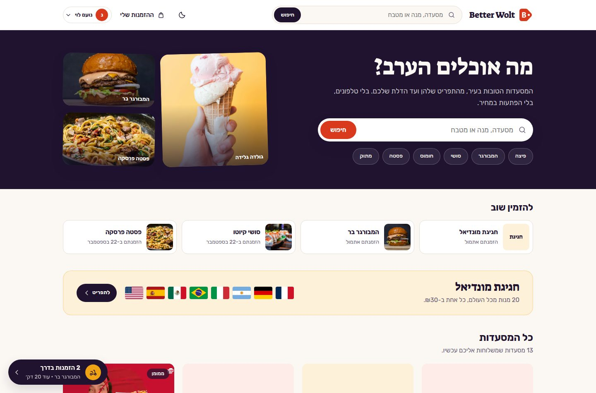
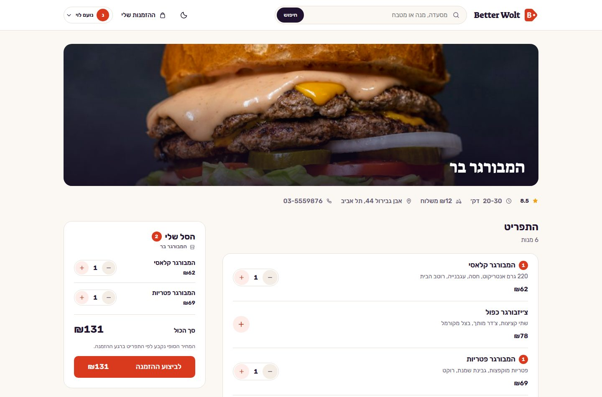
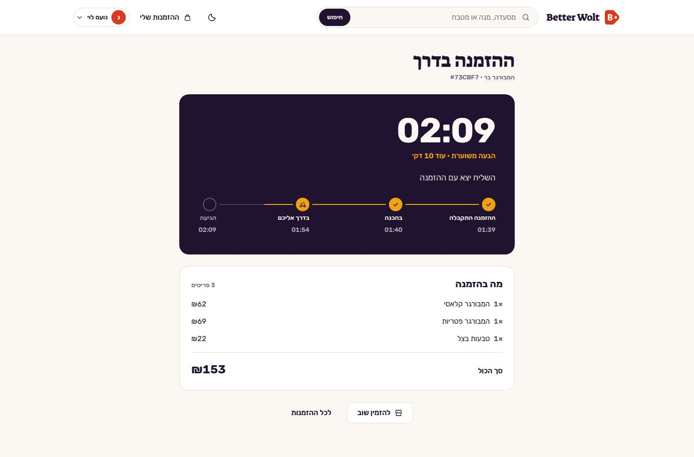
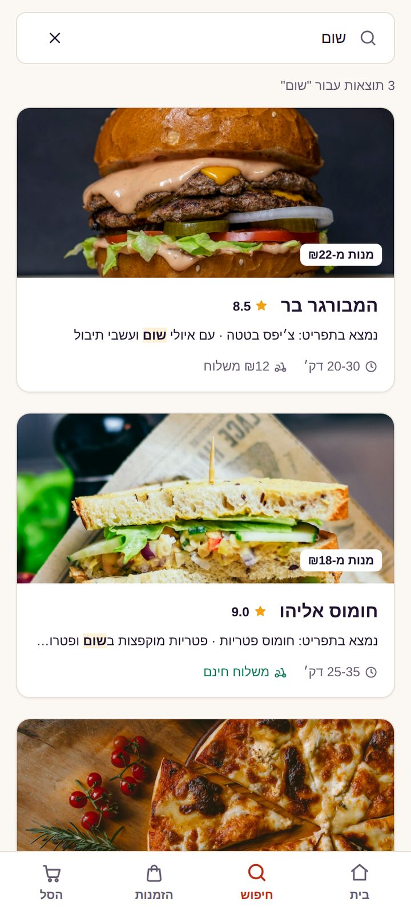
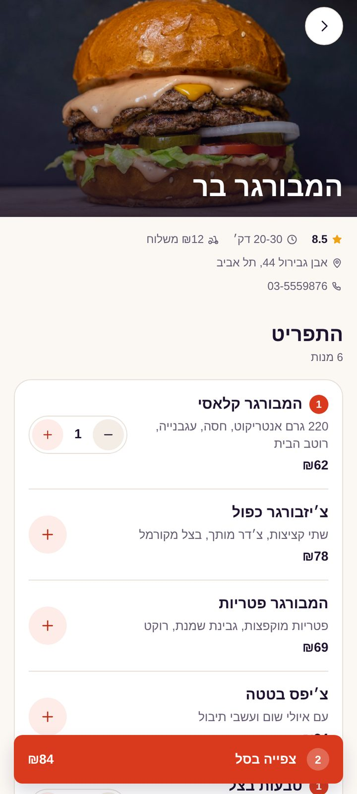
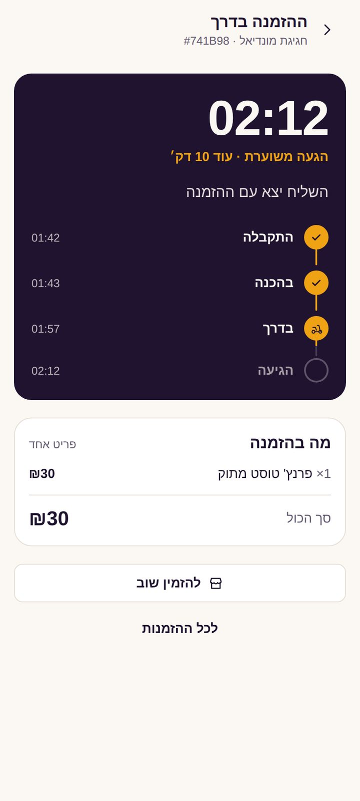

# Better Wolt

A Wolt-inspired food-delivery platform: a React web app and a React Native / Expo mobile app on one Express and
MongoDB API, designed in Hebrew, right to left.

<sub>An educational project. Not affiliated with, sponsored by or endorsed by Wolt.</sub>

**[Showcase](docs/SHOWCASE.md)** · **[Architecture & API](docs/ARCHITECTURE.md)** ·
**[Run it locally](docs/DEVELOPMENT.md)** · **[All documentation](docs/README.md)**

<p align="center">
  <picture>
    <source media="(prefers-color-scheme: dark)" srcset="docs/screenshots/v4/web-home-dark.jpg">
    
  </picture>
</p>
<p align="center"><sub>The web home page. It follows your GitHub theme: light or dark.</sub></p>

## Highlights

- **Two clients, one API.** A React web app and an Expo mobile app, both built on the same REST API and data.
- **Customers and restaurant owners.** Customers search, fill a cart, order, and order again from their history.
  Owners create a restaurant and manage its details and menu.
- **The whole order journey.** Search by restaurant, dish or address; add from the menu; check out; follow the
  order through four timed stages to its arrival time; find it later in a history grouped by day.
- **Hebrew first.** Right-to-left layout by design on both clients: CSS logical properties on the web and a
  direction-aware theme layer on mobile, never a mirrored patch.
- **One design language.** Shared design tokens, light and dark themes, a designed loading, empty and error state
  on every screen, and motion that stops under the system's reduced-motion setting.
- **A World Cup campaign.** Twenty dishes from a restaurant the server seeds, ordered through the ordinary cart.

## Product preview

<p align="center">
  
  &nbsp;
  
</p>
<p align="center"><sub>Web: a restaurant with the cart beside its menu · tracking an order</sub></p>

<p align="center">
  
  &nbsp;
  
  &nbsp;
  
</p>
<p align="center"><sub>Mobile (Expo): search · a restaurant with the cart bar · tracking an order</sub></p>

Owner tools, search, orders, sign-in, the phone-width web app and every mobile screen are in the
**[showcase](docs/SHOWCASE.md)**.

## Architecture

```text
React web ───────────┐
                     ├──►  Express 5 REST API  ──►  MongoDB 7
React Native / Expo ─┘
```

Both clients call the same `/api`. Each has its own small API client, and one written contract in
[ARCHITECTURE.md §4](docs/ARCHITECTURE.md#4-api-contract) keeps them in step. The backend is organized by feature
(`routes → controller → service → model`). In production a single Docker image builds the web app and serves it
next to the API.

## Tech stack

| Layer | Built with |
|---|---|
| Web | React 19, React Router 7, Create React App; CSS custom-property design tokens, no UI framework |
| Mobile | React Native 0.85, Expo SDK 56, React Navigation 7, react-native-svg |
| API | Node.js 24, Express 5, Mongoose 9, Zod 4, JSON Web Tokens, bcryptjs, express-rate-limit |
| Data | MongoDB 7 |
| Quality & delivery | `node:test` + Supertest, Jest + Testing Library, Docker Compose, GitHub Actions |

## Quick start

You need Docker with Compose.

```bash
cp .env.example .env    # then set JWT_SECRET to a long random value
docker compose up -d --build mongo backend
```

Open **<http://localhost:8080>**. A new database holds only the World Cup restaurant. To add the sample restaurants
from the screenshots and two demo accounts, run `node docs/dev/demo-data.mjs` (Node 18 or later).

To run the mobile app, set up the fast development loop or run the tests, see **[DEVELOPMENT.md](docs/DEVELOPMENT.md)**.

## Engineering highlights

- **The server sets every price.** An order carries only product ids and quantities. The API looks each product up
  in the restaurant's menu, records its name and price, and computes the total and status. It never reads a price,
  total or status from the request. See [order pricing](docs/ARCHITECTURE.md#36-order-pricing).
- **Authorization rules are tested.** Owner routes pass through one ownership check. Another user's order answers
  `404`, not `403`, so it does not reveal whether an order exists. Endpoint tests cover the happy path, a missing
  token, invalid input and, where it applies, another user's access. See the
  [authorization matrix](docs/V2_SPEC.md#32-authorization-matrix).
- **Validation at the boundary.** Zod checks every request body at the route. Every error has the same
  `{ "error": "…" }` shape, and no driver or stack text reaches a client. The error strings are part of the contract,
  because both clients display them.
- **Hardened sign-in.** Passwords are hashed with bcrypt. Only HS256 tokens are accepted. Login and registration are
  rate limited per IP, and an unknown username takes as long to reject as a wrong password.
- **Feature modules.** Each backend feature lives in its own folder, and a feature may import another feature's
  service only. [EXTENDING.md](docs/EXTENDING.md) walks through adding one.
- **Production container and CI.** The image is multi-stage, runs as a non-root user and has a health check. MongoDB
  is published on localhost only. CI runs the API tests against MongoDB 7, runs the web tests and build, builds the
  image and bundles the Android app.

The details, and the limitations kept on purpose, are in [ARCHITECTURE.md §9–10](docs/ARCHITECTURE.md#9-security-measures).

## Documentation

| | |
|---|---|
| [Showcase](docs/SHOWCASE.md) | Every V4 screen on web and mobile, and the design language behind them |
| [Architecture & API](docs/ARCHITECTURE.md) | Structure, conventions, the full API contract, security measures and known limitations |
| [Development](docs/DEVELOPMENT.md) | Running the stack, the mobile app, tests, configuration |
| [Extending](docs/EXTENDING.md) | How to add a backend feature, with a worked example |
| [V4 design spec](docs/V4_DESIGN_SPEC.md) | Colour, type, components, motion, RTL and accessibility rules |
| [Documentation index](docs/README.md) | Everything else, including the specs and plans for V2, V3 and V4 |

## Project context

Better Wolt began as a team course project (final grade 97/100). Its web, mobile, backend, database and
infrastructure are the team's shared work. Three passes followed, each on its own branch: **V2** reorganized the
backend around features and integration tests, **V3** redesigned both clients, and **V4**, this branch, refined
them. The [documentation index](docs/README.md#project-history) keeps the spec and plan for each pass.

## Disclaimer

Better Wolt is an educational project inspired by Wolt. It is not affiliated with, sponsored by or endorsed by Wolt.
Wolt and all other third-party trademarks belong to their owners. The photos, ratings, delivery times and fees
shown in the app are only there to illustrate the design.
