# Better Wolt — Showcase

The V4 interface on web and mobile. Every screen is in Hebrew and laid out right to left.

The web captures come from Chrome at 1440 × 950 and 390 × 844. The mobile captures show the Expo app running on
Expo's web target at 412 × 915, scaled to 720 px wide; they were not taken on a physical device. Restaurants and
photos come from the sample data ([`docs/dev/demo-data.mjs`](dev/demo-data.mjs)). Ratings, delivery times and fees
are computed by the clients for display, because the API has no such fields.

**On this page:** [Web](#web) · [Mobile app](#mobile-app) · [Design language](#design-language) ·
[Earlier versions](#earlier-versions)

## Web

### Discovery

  

Home: search leads, three photos link straight to their restaurants, and a signed-in customer's
recent restaurants come next.

  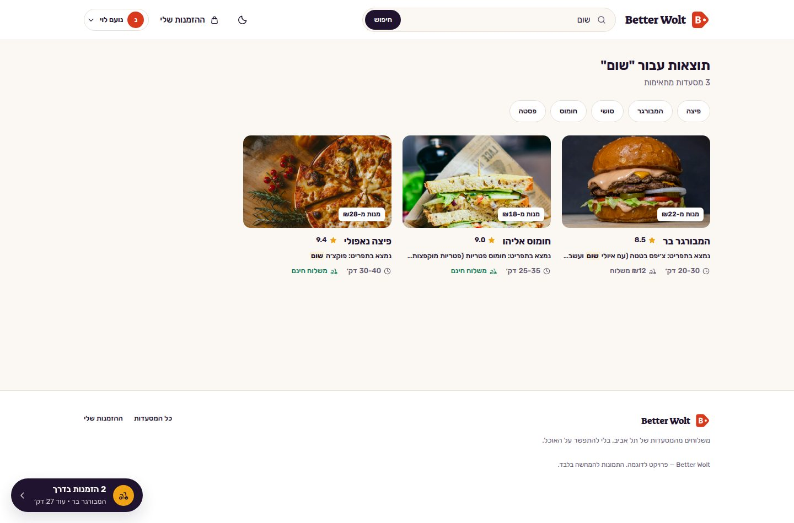

Search matches restaurant names, addresses, dishes and descriptions, and each result says what
matched.

### Restaurant, cart and checkout

  

The menu reads as one list with a small round add control. The cart names its restaurant and
carries the total in its button. The final price is set by the server when the order is placed.

  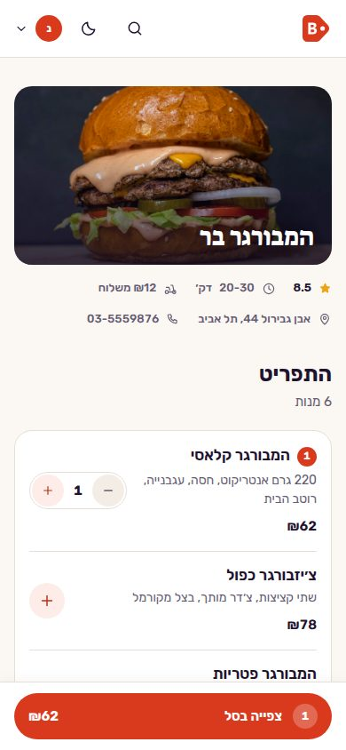
  &nbsp;
  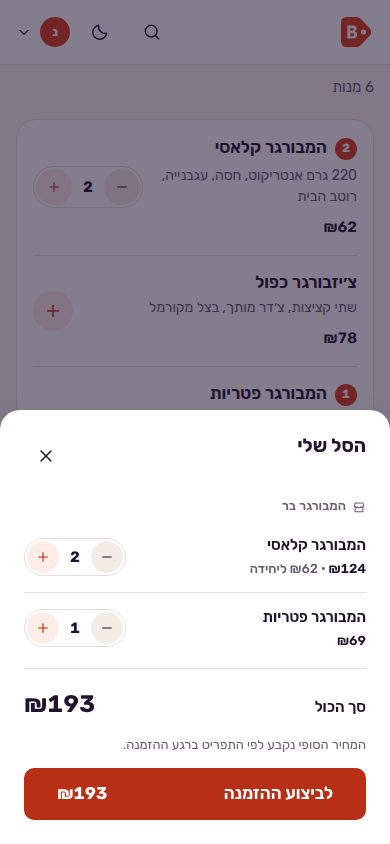
  &nbsp;
  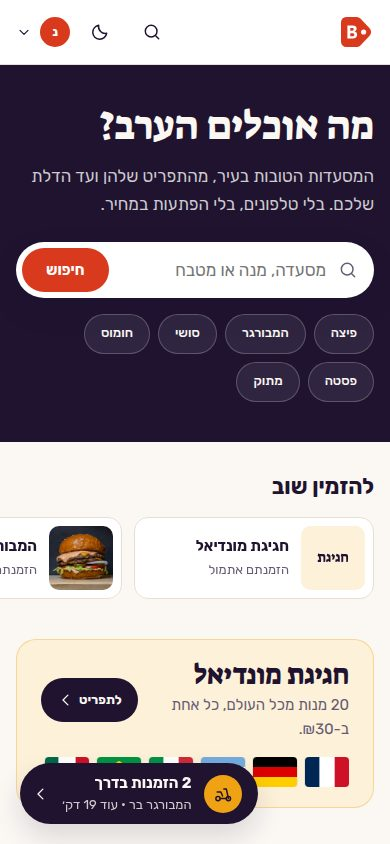

The same web app at 390 px: the restaurant, the cart as a bottom sheet, the home page.

### Tracking and orders

  

Tracking leads with the arrival time and shows four stages, each with the time it began. The
stages are timed from when the server recorded the order.

  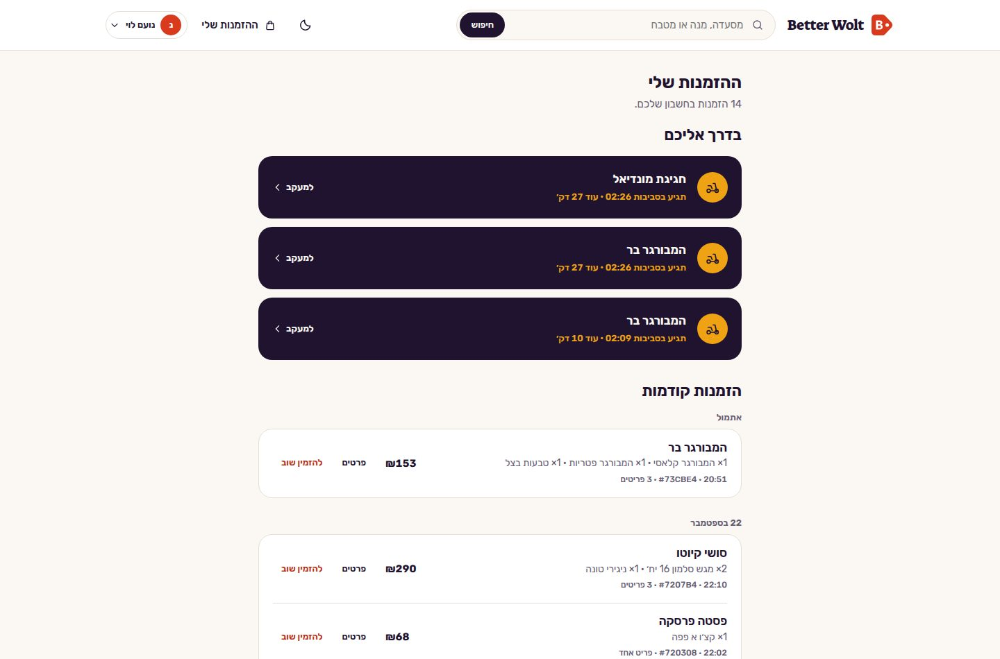
  &nbsp;
  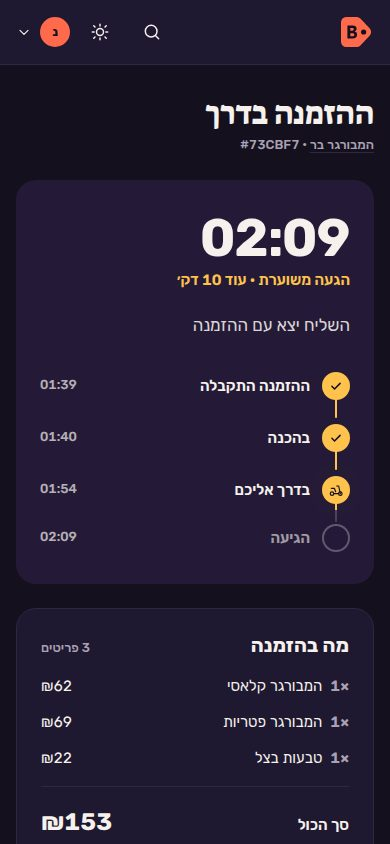

Orders: what is on its way first, then history grouped by day, each order with its receipt and
"order again". On a phone, the tracking timeline turns vertical.

### Restaurant owners

  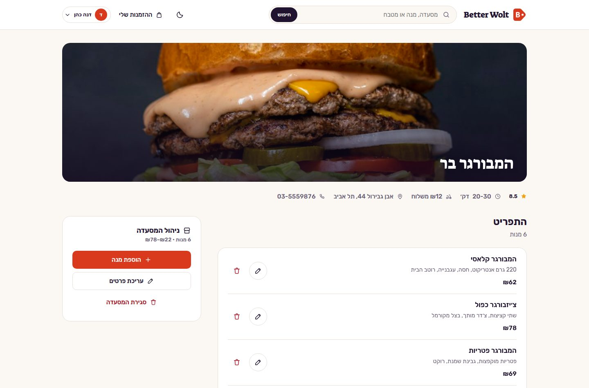

An owner sees their restaurant with the tools in place: add a dish, edit or delete one, edit
the details, or close the restaurant. The API checks ownership on every one of these actions.

### World Cup campaign

  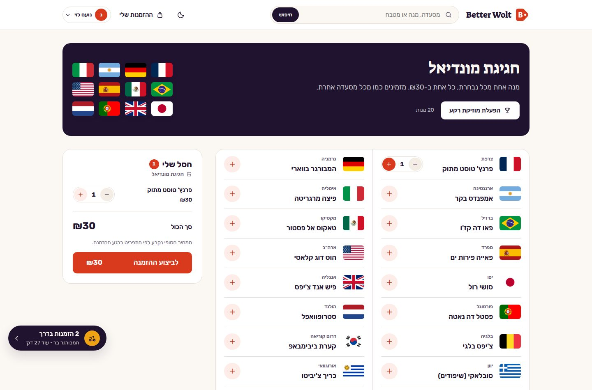

Twenty dishes from twenty countries at one flat price, ordered through the ordinary cart. The
restaurant and its menu are seeded by the server as real records. Background music plays only when asked for.

### Sign-in and the dark theme

  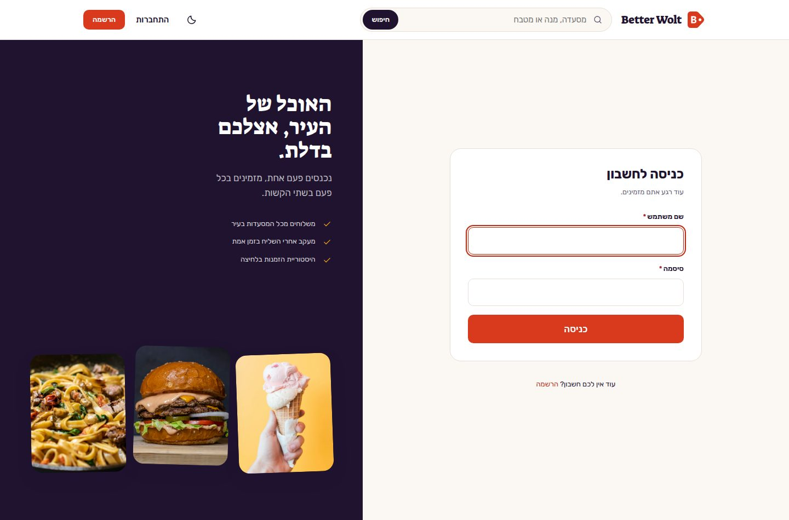
  &nbsp;
  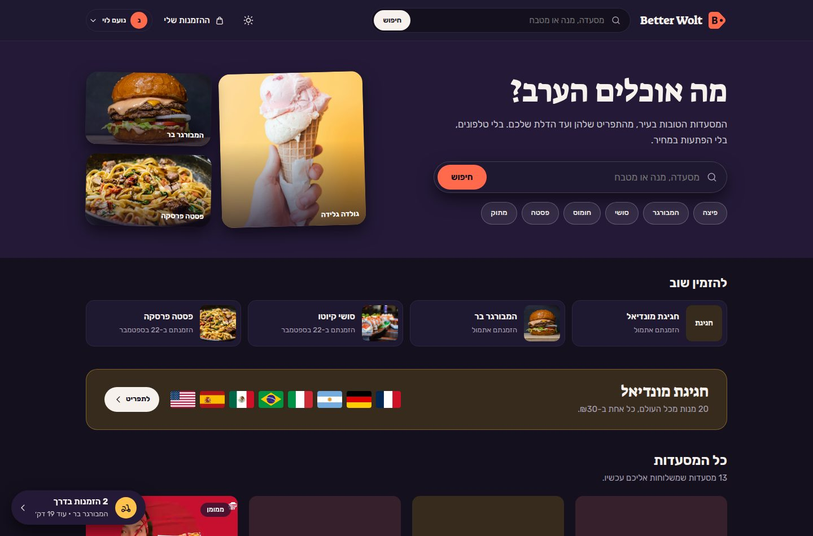

Sign-in · the dark theme, which follows the system until a theme is chosen.

## Mobile app

React Native with Expo, bottom-tab navigation and the same design tokens as the web client.

  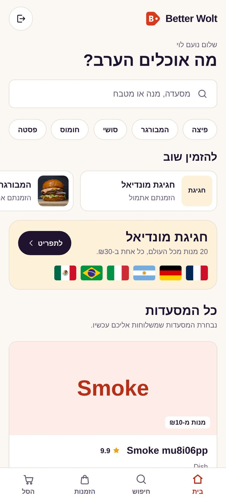
  &nbsp;
  
  &nbsp;
  

Home · search · a restaurant with the cart bar

  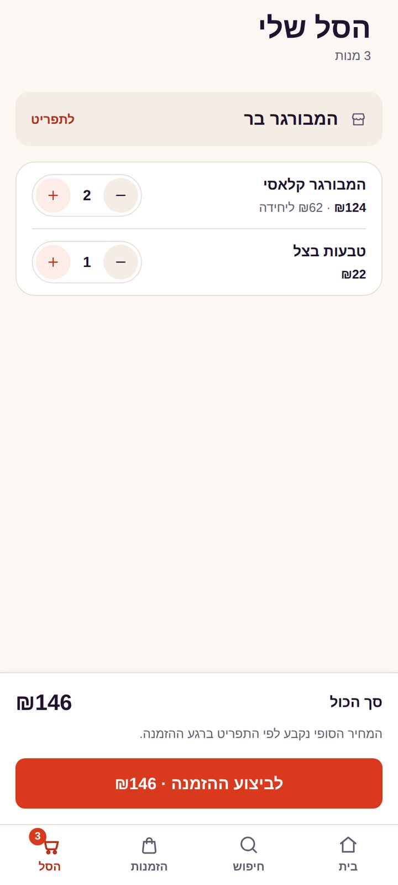
  &nbsp;
  
  &nbsp;
  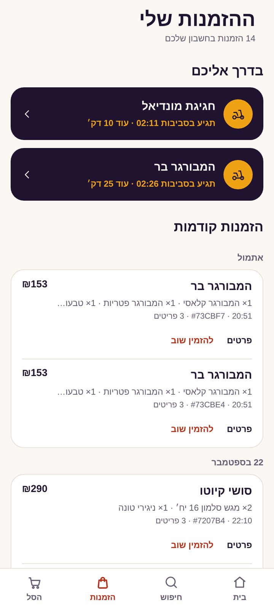

Cart · tracking · orders

  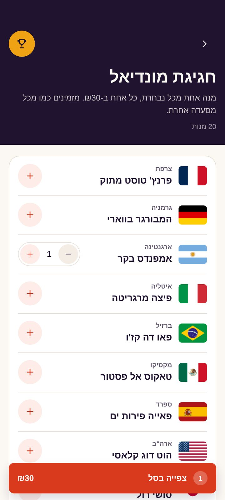
  &nbsp;
  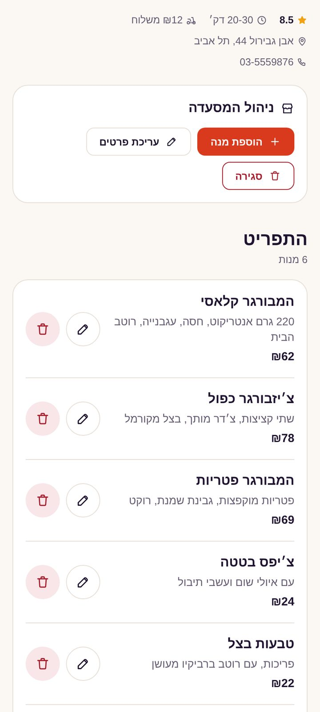
  &nbsp;
  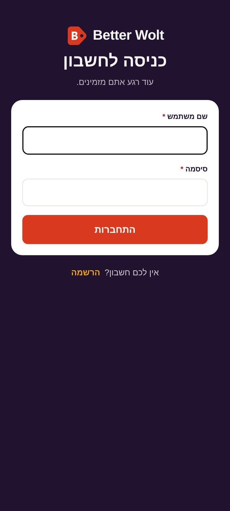

World Cup · owner tools · sign-in

## Design language

Warm paper surfaces, a deep aubergine ink, one pomegranate action colour and an amber highlight. Food is loud and
the interface around it is quiet. Photography leads, and a restaurant without a photo gets a designed plate in its own
tint. A menu reads like a menu: one list, the dish name first, and a small round add control instead of a button on
every row.

Prices, totals and times use tabular figures and are never set in the display face. Problems at checkout appear
beside the cart and stay until they are dealt with, and when the server corrects a price, the tracking page explains
it. Motion only answers an action (the cart bar rising, a count bumping) or shows time passing (the tracking stages),
and it stops under the operating system's reduced-motion setting.

Hebrew is the layout, not a patch. The web uses CSS logical properties and plaintext bidi for what people type, and
the mobile theme has a direction-aware layer instead of `I18nManager.forceRTL`.

The full rules are in the [V4 design spec](V4_DESIGN_SPEC.md). The browser audit that led to them is
[V4_VISUAL_AUDIT.md](V4_VISUAL_AUDIT.md).

## Earlier versions

The same home page in V3 and V4:

  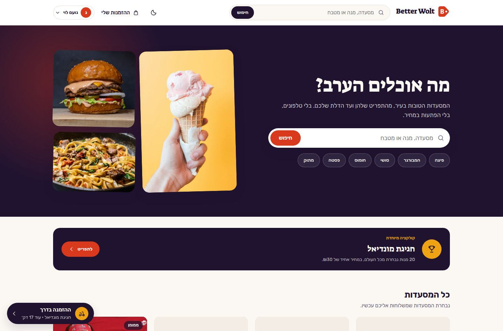
  &nbsp;
  

V3 · V4

| Version | Screenshots | What changed |
|---|---|---|
| V1 | [`screenshots/v1`](screenshots/v1) | The original course release |
| V2 | [`screenshots/v2`](screenshots/v2) | Backend restructured; captured as the starting point for the V3 redesign |
| V3 | [`screenshots/v3`](screenshots/v3) | Both clients redesigned around the design tokens ([spec](V3_DESIGN_SPEC.md)) |
| V4 | [`screenshots/v4`](screenshots/v4) | The refinement shown above ([spec](V4_DESIGN_SPEC.md)) |
